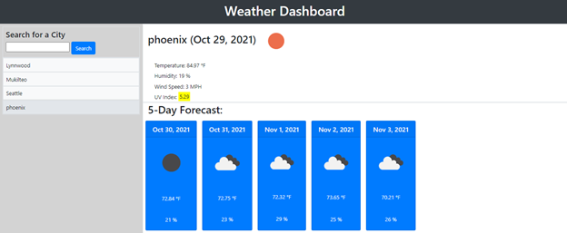
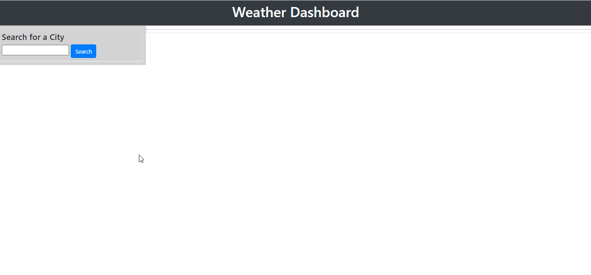

# Weather-Dashboard

## Purpose

Created a dashboard that uses the OpenWeather API to retrieve weather data for cities that are searched for by user.
In this app, the user enters the name of a city in the search field, then clicks the search button. The app will display the current weather conditions in that city, including temperature, humidity, UV index, and a picture representing whether it is clear, cloudy, raining, etc. Additionally, a 5-day forecast for that city is displayed below the current conditions showing similar information (predicted at 12:00 PM on each day).

Every time a user searches for a city, a button displaying that search information is created underneath the search field. When the user clicks on that button, a new search is executed for that location.

## Technologies:

This project is created with:

- HTML5
- CSS
- Javascript
- OpenWeather API
- Bootstrap
- Moment.js

## Screenshot

## Demo

## Website

https://ebazazzadeh.github.io/Weather-Dashboard/

## Contribution

Made by Elham Bazazzadeh @2021 All right reserved.
